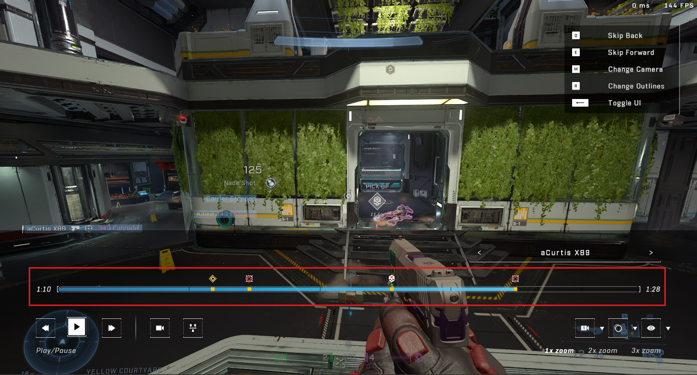

# Welcome to SPNKr

SPNKr is an async Python SDK for the undocumented Halo Infinite web API.

It is intended for personal analysis workflows (match history, skill/rank data,
metadata, and theater film parsing). The project is unofficial and provided as-is.

- Documentation: https://acurtis166.github.io/SPNKr/
- PyPI: https://pypi.org/project/spnkr/
- GitHub: https://github.com/acurtis166/spnkr

## What You Can Do

- Request player match history, service records, and match stats.
- Retrieve skill/MMR/CSR data by match or playlist.
- Resolve player profile data (XUID <-> gamertag).
- Fetch content metadata (maps, modes, playlists, medals, season data).
- Access economy/customization-related endpoints.
- Download and parse theater film highlight events.

## Install

Requires Python >= 3.11.

```shell
pip install spnkr
```

Optional caching support:

```shell
pip install "spnkr[cache]"
```

## Quickstart

### 1. Get tokens

SPNKr needs these Halo headers:

- `x-343-authorization-spartan`
- `343-clearance`

You can get them in two ways:

1. Manual (fastest): copy headers from Halo Waypoint network traffic.
1. Programmatic (recommended): use Azure app registration + refresh flow.

Detailed steps are in the docs:

- https://acurtis166.github.io/SPNKr/getting-started/

### 2. Create the client

```python
import asyncio

from aiohttp import ClientSession
from spnkr import HaloInfiniteClient


async def main() -> None:
    async with ClientSession() as session:
        client = HaloInfiniteClient(
            session=session,
            spartan_token="SPARTAN_TOKEN",
            clearance_token="CLEARANCE_TOKEN",
            requests_per_second=5,
        )

        # Accepts gamertag, raw XUID, or wrapped xuid(...) formats.
        resp = await client.stats.get_match_history("MyGamertag", start=0, count=5)
        history = await resp.parse()

        if history.results:
            latest = history.results[0].match_info
            print(f"Latest match start: {latest.start_time:%Y-%m-%d %H:%M:%S}")


if __name__ == "__main__":
    asyncio.run(main())
```

### 3. Refresh tokens when needed

Spartan tokens are short-lived. If you already have replacement tokens, update an
existing client without recreating it:

```python
client.set_tokens(spartan_token="NEW_SPARTAN", clearance_token="NEW_CLEARANCE")
```

For automated token refresh, see auth helpers:

- `authenticate_player`
- `refresh_player_tokens`

Reference: https://acurtis166.github.io/SPNKr/reference/authentication/

## Service Overview

`HaloInfiniteClient` exposes service properties for the main API domains:

| Property | Purpose |
| - | - |
| `client.stats` | Match history, service records, and match stats |
| `client.skill` | MMR/CSR and other skill-related data |
| `client.profile` | Player identity/profile lookups |
| `client.discovery_ugc` | Maps, game variants, playlists, and UGC metadata |
| `client.gamecms_hacs` | Medals, seasons, career reward track, and other CMS data |
| `client.economy` | Store/customization related data |

Reference: https://acurtis166.github.io/SPNKr/reference/services/

## Response Parsing Model

Service methods return response wrappers around `aiohttp.ClientResponse`.
Use `.parse()` to convert payloads into Pydantic models while still retaining
access to the raw response when needed.

- Wrappers: https://acurtis166.github.io/SPNKr/reference/responses/
- Models: https://acurtis166.github.io/SPNKr/reference/models/

## Caching

SPNKr supports `aiohttp-client-cache` as a drop-in session replacement.
This can reduce repeated requests, especially for metadata-heavy workflows.

When caching localized Discovery UGC calls (for example with
`language="fr-FR"`), configure cache keys to account for language and avoid
token-specific duplication.

Full caching guidance: https://acurtis166.github.io/SPNKr/basic-usage/

## Film / Theater Parsing

The `spnkr.film` module includes helpers for downloading film chunks and parsing
timestamped highlight events from theater recordings.

In theater mode, these highlight events appear as timeline markers for key match
moments such as kills, deaths, medals, and mode-specific events.



Reference: https://acurtis166.github.io/SPNKr/reference/film/

## Acknowledgements

- Xbox Live authentication flow: https://github.com/OpenXbox/xbox-webapi-python
- Halo Infinite authentication flow and endpoint research: https://den.dev/blog/halo-api-authentication
- Microsoft/343 Industries

## Disclaimer

This software is not endorsed or supported by Microsoft or 343 Industries.
It is a personal project for Halo Infinite data analysis.

Authentication requires personal credentials and tokens; use at your own risk.

## Contributing

Contributions to fix issues or add endpoint support are welcome.
